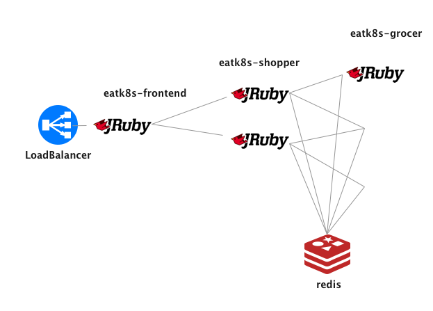

# eatk8s

🍏☸

## A little K8s test app

I wrote this little app to run tests on Kubernetes. While I love the hipster and sock shops, they are big and complicated, and I just wanted something simpler.

- Simple code base
- Runs in nodeJS
- Microservices for transaction tracing
- Front end UX to increase memory and CPU load

## A little demo

## Architecture

